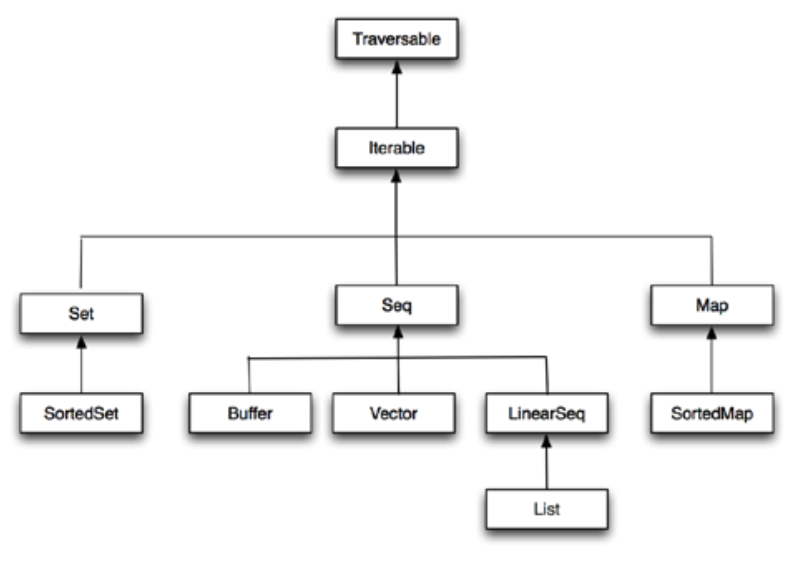
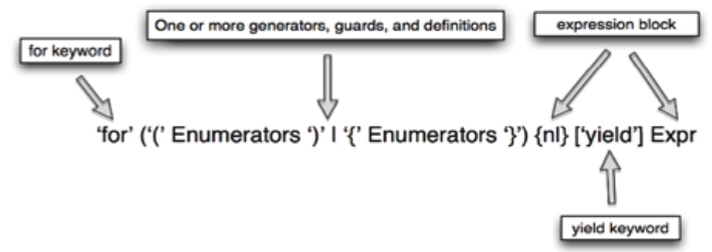

Refcard \#164

**Getting Started With Scala**

A General-Purpose Programming Language

Original by Ryan Knight & Nilanjan Raychaudhuri

**SECTION 1**

**What is Scala?**

Scala is a general-purpose programming language designed to express common programming patterns in a concise, elegant, and type-safe way. It smoothly integrates features of object-oriented and functional programming languages, enabling programmers to be more productive. Scala is an acronym for “Scalable Language”. This means that Scala grows with you.

An important aspect of Scala is that it runs inside the JVM. That means it can leverage existing Java Libraries and libraries written in Scala can be called from Java.

**SECTION 2**

**Resources for Getting Started***

There are many resources available for getting started with Scala. Of course, one of the first places to start is with the [Scala documentation](http://docs.scala-lang.org/). On the first page of the Scala documentation, you will find the First Steps... section, which will direct you to the prototypical [Getting Started](http://docs.scala-lang.org/getting-started.html) documentation.

Choose the path for either setting your development environment with IntelliJ or using the command line.  Both paths will walk you through the steps for creating and running the classic hello world program in Scala.

```scala
object Hello extends App {
  println("Hello, World!")
}
```

Your new project will have the following layout:

```
- hello-world
    - project (sbt uses this to install manage plugins and dependencies)
        - build.properties
    - src
        - main
            - scala (All of your scala code goes here)
                -Main.scala (Entry point of program) <-- this is all we need for now
    build.sbt (the sbt build definition file)
```

The details of `build.sbt` will be covered in the Build section later on.

**SECTION 3**

**Hello Scala – An Intro Tour of Scala Features**

The most important feature of Scala is that it tends to be very enjoyable. This is because there is no boilerplate code and a lightweight syntax, but at the same time it has the safety of a strong static type system.

Let's say hello to Scala by modifying the `Hello.scala` file either in a command line editor or in an IDE. In the command line the code is automatically run after the file is changed and saved (Ctrl + S) using the command `sbt ~run`. The `~` is optional and causes `sbt` to re-run on every file save, allowing for a fast edit/run/debug cycle.

In Scala, variables can either be mutable or immutable. An immutable variable is a variable that cannot be modified after it has been created. There are a number of reasons for using immutable variables. For instance, they are inherently thread-safe. Another reason is that they are easier to reason about because you know the value cannot change. The best practice is to start off with an immutable variable and only make it mutable if needed.

To create an immutable variable you preface it with the `val` keyword and mutable variables are created with the `var` keyword. In the `Hello.scala` file let's start by creating an immutable `String` variable called first and printing it out:

```scala
val first:String = "Hello"
println(first)
```

If you are running this using `sbt ~run`, after you save the file go to the terminal window to see the results.

To understand what it means to be immutable, try assigning the variable first to a new value:

```scala
first = "Something Else"
```

When you save it, the compile of the source file with fail:

```
[info] Compiling 1 Scala source to /Users/demo/hello-world-cli/target/scala-2.12/classes ...
[error] /Users/demo/hello-world-cli/src/main/scala/Hello.scala:5:7: reassignment to val
[error] first = "Something Else"
[error]       ^
[error] one error found
[error] (compile:compileIncremental) Compilation failed
[error] Total time: 1 s, completed Nov 16, 2017 3:36:17 PM
```

Now let's change first to be a mutable variable by going back up and changing the `val` to `var` and saving the program. This time the program compiles and if you print out the first variable after changing the value you will see the changed value.

Continuing the exploration of Scala features, let's look next at type inference, which means the Scala compiler infers the type of a variable. This allows the programmer to omit certain types annotations. To see this in action change the declaration of the first variable by removing the type:

```
var first = "Hello"
```

What you will notice is that the program still compiles. The Scala compiler has inferred first as a `String` because it was assigned a `String` value. This is different than a dynamic language like JavaScript that allows the type of the variable to change. In Scala you cannot change the type of the variable after it has been declared. For example, try assigning first to a number:

```
first = 2
```

You will get a type mismatch error saying the compiler found an `Int` but it required a `String`.

```
[error] /Users/demo/hello-world-cli/src/main/scala/Hello.scala:6:9: type mismatch;
[error]  found   : Int(2)
[error]  required: String
[error] first = 2
[error]         ^
[error] one error found
[error] (compile:compileIncremental) Compilation failed
[error] Total time: 0 s, completed Nov 16, 2017 3:49:08 PM
```

Be sure to delete this line so your sample will continue to compile.

Type Inference is really powerful in Scala and can be used to infer the type of variables, methods, functions, and other expressions. It should be used with some caution though, as the Scala Style Guide (http://docs.scala-lang.org/style/types.html) says:

“Use type inference where possible, but put clarity first, and favor explicitness in public APIs.”

Another feature that makes Scala unique is that it is fully expression-oriented. For example, let's create an `Int` (an integer type in Scala) variable and assign it to the result of a basic calculation:

```scala
val second = {
  val tmp = 2 * 5
  tmp + 88
}
```

This assigns a value of 98 to second. Notice that it does not require an explicit return statement and instead takes the last line to be the value returned. In the same way, an if-else is an expression in Scala and yields a result. We could create a `String` variable `displayFlag` that is the result of a basic if-else test:

```scala
val second = 43
val displayFlag = if (second%2 == 0) {
  "Second is Even"
}
else {
  "Second is Odd"
}
```

Or in shorthand notation this could be expressed as:

```scala
val displayFlag = if (second%2 == 0)  
                    "Second is even"
                  else  
                    "Second is odd"
```

Lets now dive in-depth into some more Scala features.

**SECTION 4**

**Classes and Objects**

Scala is a pure object-oriented language. Conceptually, every value is an object and every operation is a method call. You can follow along with the below examples by creating an additional file in the editor that has the same name as the class. For example, to create a class `Recipe` add a `Recipe.scala` file in the `src/main/scala` directory and then add the following definition in the file:

```scala
class Recipe(calories: Int) {
  println(s"Created recipe with ${calories} calories")
  var cookTime: Int = _ // sets 0, default value of Int
}
```

This creates a Scala class called `Recipe` with a constructor that takes calories as a parameter. Unlike Java, the constructor arguments are included in the class definition. Then any expressions in the body of the class are considered part of the "primary constructor", such as the `println`. If you need alternative ways to create instances of the class, you can define secondary constructors with different arguments, but that is not covered here.

In addition to constructor parameters, a class has fields, such as `cookTime` in the previous example. These fields can either be a `val` or `var` just like a standard variable declaration. By default the constructor parameters for a class are only visible inside the class itself and only fields are visible outside of the class. To understand the differences back in the Hello `main` method, try creating an instance of `Recipe` by invoking the primary constructor and then try printing out the values from the class:

```scala
val r = new Recipe(100)
println(r.cookTime)      // outputs 0
println(r.cookTime = 2)  // sets the cookTime to 2
// This will produce an error - value calories is not a member of recipe
println(r.calories)
```

To promote the constructor parameters to fields, a `val` or `var` needs to be added in front of the parameter depending on whether they are supposed to be immutable or mutable fields. For example, change the Recipe class definition to:

```scala
class Recipe(val calories: Int) {
```

Then try printing out the calories again in the main method. Now the compiler should be happy.

Method definitions in Scala start with the keyword `def` followed by the name of the method and its parameters. The return type of the method can be inferred, just like with variables. The following defines a method `estimatedEffort` that calculates the estimated effort for the recipe based on the number of servings and returns per `Int`. The return value is the last line of the method.

```scala
// Declares method that returns an Int - Int return is optional.
def estimatedEffort(servings:Int):Int = {
  println("estimating the effort...")
  servings * cookTime * calories
}
```

We can also create subclasses by extending abstract or non-final classes just like any object-oriented language. The one difference is the constructor parameters of the class being extended need to be passed in as well.

```scala
class Food(calories: Int)
class Salad(val lettuceCalories: Int, val dressingCalories: Int)
  extends Food(lettuceCalories + dressingCalories)
```

When extending a class we can also override members of parent classes.

```scala
// Example of Overriding Methods
class Menu(items: List[Food]) {
  def numberOfMenuItems() = items.size
}
// Dinners only consists of Salads
class Dinner(items: List[Salad]) extends Menu(items) {
  // Overriding def as val   
  override def numberOfMenuItems = 2 * items.size
}
val s1 = new Salad(5,5)
val s2 = new Salad(15,15)
val dinner = new Dinner(List(s1,s2))
// prints 4
println(s"Number Of Menu Items = ${dinner.numberOfMenuItems}")
```

Scala does not have a static keyword like Java to mark a definition as a static (singleton) instance. Instead it uses the object keyword to declare a singleton object. All the members defined inside the object are treated as static members and can be accessed without creating an explicit instance. The astute reader might have noticed that the definition in `Hello.scala` is declared as the object `Hello`. That is because a single instance of main is needed for running the program.

A common use of the singleton object is for declaring constants. For example, add the following line above the Hello `main` method:

```scala
val WATERMELON_CALORIES = 98
```

Then access the constant with the following line inside the main method:

```scala
println(WATERMELON_CALORIES)
```

Objects are commonly used to hold factory methods for creating classes. This pattern is so common that Scala declares a special method definition for this called `apply`. The `apply` method can be thought of like a default factory method that allows the object to be called like a method. For example, inside the `Recipe.scala` file add an object above the class definition:

```scala
object Recipe {
  // Assume the client was only guessing the calories and
  // double just in case
  def apply(calories:Int) = new Recipe(calories * 2)
}
```

Then back in the Hello `main` method, change the creation of Recipe to the following:

```scala
// This call refers to the Recipe object and is the same as calling Recipe.apply(100)
val r = Recipe(100)  // apply method is called by default
println(r.calories)  // outputs 200
```

What is interesting about the use of the Recipe object here is that no method had to be specified—apply was called by default.

An object is considered a companion object when it is declared in the same file as the class and shares the name and the package. Companion objects are used to hold the static definitions related to class but do not have any special relationship to a class.

**SECTION 5**

**Case Classes**

Case classes in Scala are classes on steroids. When the Scala compiler sees a case class, it automatically generates helpful boilerplate code to reduce the amount of code for common tasks. The only difference is the class definition has the keyword case before it:

```scala
case class Person(name: String, age: Int)
```

When we prefix a class with `case`, the following things happen:

-   Constructor parameters (such as name and age) are made immutable fields by default. Scala does this by prefixing all parameters with val automatically.

-   Equals, hashCode and toString are generated based on the constructor parameters.

-   A copy method is generated so we can easily create a modified copy of a class instance.

-   A default implementation is provided for serialization.

-   A companion object and the default apply factory method is created.

-   Pattern matching on the class is made possible. This is not covered in this introduction but is a very important reason to use case classes.

Because Person is defined as a case class it will be compiled into something like the following:

```scala
class Person(val name: String, val age: Int) { ... }

object Person {
  def apply(name: String, age: Int) = new Person(name, age)
  ...
}
```

Here object Person is the companion object for class Person.

The Person class can then be created without using the new keyword:

```scala
val p = Person("John", 26) // same as Person.apply("John", 26)
```

We can also define additional `apply` methods inside classes and objects.

**SECTION 6**

**Traits**

Traits can be viewed as an interface that provides a default implementation of some of the methods (Java 8 added something similar with default methods on interfaces). In contrast to classes, traits may not have constructor parameters and are not instantiated directly like a class. They can be used similarly to an abstract class:

```scala
// Declaring a trait with an abstract method
trait Greetings {
  def sayHello: String
}

class JapaneseGreetings extends Greetings {
  override def sayHello: String = "konnichiwa"
}
```

The `JapaneseGreetings` class extends the `Greetings` trait and implements the `sayHello` method.

Traits can also be used to provide methods and variables that are mixed into a class instead of being extended. Let's make this example more interesting by adding one more trait.

```scala
trait DefaultGreetings {
  def defaultHello = “Hello”  
}

class GermanGreetings extends Greetings with DefaultGreetings {
  override def sayHello: String = “Guten Tag”
}

val g = new GermanGreetings
g.sayHello      // outputs Guten Tag
g.defaultHello  // outputs Hello
```

The `GermanGreetings` extends both `Greetings` and `DefaultGreetings`. The later is mixed-in to provide the default greetings behavior. Traits can also be mixed-in at the instance level:

```scala
val j = new JapaneseGreetings with DefaultGreetings
j.sayHello      // outputs konnichiwa
j.defaultHello  // outputs Hello
```

This particular instance of `JapaneseGreetings` will have both `sayHello` and `defaultHello` methods.

**SECTION 7**

**Functions**

Functions are similar to a method in Scala except that a function is attached to a class. Instead, functions are usually declared as an argument to another method, like what action should be taken when a service is called or a link is clicked on. The benefit of a function is that it allows functionality to be treated as a method argument, or code as data.

TYPE | DESCRIPTION
--- | ---
Traversable | The base trait of all collection types. Declares the foreach method and defines other methods that are available on all collections.
Iterable | Declares the iterator method. All collection types that extend Iterable can provide iterator.
Seq | The base trait for sequences. A sequence has a defined order of elements.
IndexedSeq | The base trait for array-like sequences.
LinearSeq | The base trait for linked-list-like sequences.
Set | An iterable collection type that contains no duplicate elements
SortedSet | Set that has a defined order of elements.
Map | Map is an iterable pair of keys and values. The key value pair is represented by a tuple of two elements.

Functions are also values that are assigned to variables, and functions also have types. Methods are not values. These function values can then be passed around like other variables. The following creates a function that finds the successor of any given parameter and assigns that function to the succ variable.

```scala
// Creates a function that takes an Int as a parameter and returns Int.
// The variable type in Scala is formally declared as Int => Int
val succ = (foo: Int) => { foo + 1 }
```

Here, `foo` is the name of the parameter and what comes after =&gt; is the body of the function.

We can invoke this function like we invoke methods:

```scala
succ(10) // outputs 11
```

We can also pass functions as a parameter to other functions and methods. In the following example, the `succAndLog` method takes two parameters, an integer value, and a function that takes a single `Int`, and returns an `Int`.

```scala
def succAndLog(someInt: Int, succ: Int => Int) = {
  println(s”Incrementing $someInt”)
  succ(someInt)
}

succAndLog(10, (i: Int) => i + 1) // Incrementing 10 and returns 11
```

**SECTION 8**

**Collections**

The Scala collections library is one of the most powerful features of the language. The library implements all the common data structures such as sequences, sets, and maps (also called dictionaries). Scala collections come in many forms—they can be immutable, mutable, and parallel. The language encourages you to use immutable collection APIs and imports them by default.

Here is how collection types relate to each other:

{width="6.5in" height="4.6402777777777775in"}

Here are a few examples of how collection classes can be instantiated:

```scala
val marks = IndexedSeq(50 70, 65) // creates an index sequence
val numbers = Vector(11, 22, 33)  // creates sequence of numbers
val languages = Set(“Scala”, “Haskellz”, “Java”) // set of strings
// Creates a map with a key-value pairs
val nameAndGrades =
  Map(“John” -> ‘C, “Steve” -> ‘A, “Mary” -> ‘B) // -> defines pair
val range = 0 to 10 // range of all the numbers from 0 to 10
```

Now let’s see how we can perform some common tasks using Scala collections.

**Transform all the elements of the collection**

```scala
val xs = Vector(10, 20, 30, 40)
// Map executes the given anonymous function for each element in the //collection
val newList = xs.map(x => x/2)

println(newList) // outputs new sequence Vector(5, 10, 15, 20)
println(xs)      // outputs the original collection because its immutable
```

**Filtering**

```scala
val xs = Vector(1, 2, 3, 4, 5).filter(x => x < 3)
println(xs) // outputs new collection Vector(1, 2)
```

**Grouping elements of collections based on the return value**

```scala
val groupByOddAndEven = Vector(1,2,3,4,5).groupBy(x => x % 2 == 0)
println(groupByOddAndEven) // outputs Map(false -> Vector(1, 3, 5), true -> Vector(2, 4))
```

**Sorting**

```scala
val lowestToHighest = Vector(3,1,2).sorted
println(lowestToHighest) // outputs Vector(1, 2, 3)
```

Scala provides mutable counterparts of all the immutable collections. For example, the following creates a mutable sequence of numbers:

```scala
val numbers = scala.collection.mutable.ListBuffer(10, 20, 30)
numbers(0) = 40  // updates the zeroth element to 40
println(numbers) // outputs ListBuffer(40, 20, 30)
```

Here are some of the useful methods defined in the Traversable trait that are available to all collection types:

Methods | Dscription
--- | ---
xs.size | The number of elements in the collection.
xs ++ ys | A collection consisting of the elements of both xs and ys.
xs.map(f) | The collection obtained from applying the function f to every element in xs.
xs.flatMap(f) | The collection obtained from applying the collection valued function f to every element in xs and concatenating the results.
xs.filter(p) | Returns a new collection consisting of those elements of xs that satisfy the predicate p.
xs.find(p) | An option containing the first element in xs that satisfies p, or None if no element qualifies.
xs.foldLeft(z)(op) | Apply binary operation op between successive elements of xs, going from left to right and starting with z as initial value. <br>`val x = Traversable(1, 2, 3, 4)`<br>`// sums all the numbers`<br>`x.foldLeft(0){(a, e) => a + e}`
xs.foldRight(z)(op) | Apply binary operation op between successive elements of xs, going from right to left and starting with z as initial value.
xs.head | The first element of the collection(or some element, if no order is defined).
xs.tail | The rest of the collection except xs.head.
xs.mkstring(sep) | Produces a string that shows all elements of xs between separators sep.

Scala provides another version of collection that evaluates elements in parallel. This is perfect for dividing work and taking advantage of available processing power of multi-core processors. The following example creates an instance of parallel seq collection and transforms each element in parallel.

```scala
val numbers = scala.collection.parallel.ParSeq(1, 2, 3, 4, 5, 6, 7)
```

The map method of parallel collection tries to run the given function in parallel and evaluates each element in parallel:

```scala
val newNumbers = numbers.map {x =>  
  // Prints the name of current thread
  println(s”Current thread ${Thread.currentThread.getName}”)
  x + 1
}
```

Run the above code a few times to see how different threads are used for processing the map method.

**SECTION 9**

**Concurrency**

Concurrency is hard unless you have the right level of abstraction. The most common approach to solve concurrency problems is multi-threaded code with mutable states, which is very hard to maintain and reason about. And it makes it very difficult to find bugs because they only tend to show up under a large load. Scala takes a different approach to concurrency. Instead of threads, which are a very low level constructs, Scala provides developers with a higher level of abstraction with Futures and Promises. ([Akka](http://akka.io) also provides the Actor programming paradigm that is also a high-level abstraction for concurrent programming. See the Further Learning section for additional references.) This section will only explore Future.

Future is an object holding a value that may become available at some point. This value is usually the result of some other computation. A Future object is completed with either a value or an exception. Once it is completed it becomes in effect immutable—it can never be overwritten. The simplest way to create a Future object is to invoke the Future method, which starts an asynchronous computation and returns a Future holding the result of that computation. The result becomes available once the Future completes.

```scala
import scala.concurrent.ExecutionContext.Implicits.global                  
  import scala.concurrent.Future
  def someTimeConsumingComputation(): Int = { 25 + 50 }
  val theFuture = Future { someTimeConsumingComputation() }
```

The line `import ExecutionContext.Implicits.global` above makes the default global execution context available. An execution context is a thread pool that executes the tasks submitted to it. The future object uses this execution context to asynchronously execute the given task. In this case the task is `someTimeConsumingComputation`. The statement `Future { … }` is what actually starts Future running in the given execution context.

Once a Future is completed, registering a callback can retrieve the value. A separate callback is registered for both the expected value and an exception to handle both possible outcome scenarios:

```scala
theFuture.onComplete {
  case Success(result) => println(result)
  case Failure(t) => println(s”Error: ${t.getMessage}”)
}
```

The following line will complete the future with exception:

```scala
val anotherFuture = Future { 2 / 0 }
```

Futures are very handy tool to run multiple parallel computations and then compose them together to come up with a final result. The following example starts two asynchronous tasks that may run in parallel if there were enough CPU cores available:

```scala
def stockQuote(currency: String): BigDecimal = { ... }
val usdQuote = Future { stockQuote(USD) }
val chfQuote = Future { stockQuote(CHF) }
```

Scala’s for-expression can be used to compose (or combine) the results of multiple Future objects into a single result. In this example the Futures can be composed together to make a decision as to whether we should buy stocks in CHF. To do this we reference the futures inside the for { ... } block and take the values that are returned from the future objects. Those values can then be used in the yield { ... } block to check if the value is profitable. An important point to notice is the Future is created outside the for-expression and the for-expression is acting as a callback for when the Future completes. If the Future were created inside the for-expression then the second future will only be created when the first Future completes successfully.

```scala
val isProfitable = for {
  usd <- usdQuote // returns the USD value when future is completed
  chf <- chfQuote // returns the CHF value when future is completed
} yield {
  // This will only be executed when both the futures complete
  isProfitable(usd, chf)
}
```

Finally, a callback is registered to retrieve the value of the `isProfitable` method.

```scala
isProfitable.onComplete {
  case Success(result) => println(result)
  case Failure(t) => println(s”Error: ${t.getMessage}”)
}
```

**SECTION 10**

**For-comprehensions**

A for-comprehension in Scala is like a Swiss Army knife: you can do many things with it using basic simple elements. The for expression in Scala consists of a `for` keyword followed by one or more enumerators surrounded by parentheses and an expression block or yield expression.

The following example adds all the elements of the first list with all the elements of the second list and creates a new list:

{width="6.5in" height="2.3006944444444444in"}

```scala
Val newList = for {
  a <- aList if a % 2 == 0
  b <- bList
  x = a + b // defining new val and using it inside yield
} yield x
println(newList) // prints List(6, 7, 8)
```

The if condition after a &lt;- `aList` is called a guard clause and it will filter out all the odd numbers and only invoke the `aList` generator for even numbers.

**SECTION 11**

**Build**

Scala can be built with a number of tools such as Gradle, Maven or even Ant. The most common way to build Scala however is sbt. The sbt build tool is used for managing dependencies, compiling the app, running the app, and running the tests. The primary build file is the `build.sbt` in the root of the project directory and then the `project/build.properties` file specifies the version of sbt to use along with the build properties. The primary build definition in the `build.sbt` file looks something like:

```scala
name := “””hello-scala”””
version := “1.0”
scalaVersion := “2.12.1”
libraryDependencies += “org.scalatest” % “scalatest_2.11” % “2.1.3” % “test”
```

The `libraryDependencies` section of the `build.sbt` defines the application dependencies, which should be available in a public Maven repository. You can also add your own Maven repository using the resolvers setting. The dependencies in `libraryDependencies` are a comma-separated list in the form:

```scala
“group” % “artifact” % “version”
```

As an example, to add the `jsoup` driver add the following line:

```scala
libraryDependencies += “org.jsoup” % “jsoup” % “1.7.3”
```

Sbt build also supports sub-projects so that you can partition your application into multiple smaller pieces. This can improve build times and make different pieces more easily reusable.

More information about sbt can be found on the [sbt homepage](http://www.scala-sbt.org/).

**SECTION 12**

**Further Learning**

Coursera provides a free online Scala training course: <https://www.coursera.org/course/progfun>

Community-driven documentation for Scala can be found at: [http://docs.scala-lang.org](http://docs.scala-lang.org/)

Lightbend provides a number of Free E-Books at:  <https://www.lightbend.com/learn#type=ebook>

Scala sample projects at Lightbend TechHub:  <https://developer.lightbend.com/start/?group=scala>

Atomic Scala Examples: <https://github.com/AtomicScala/atomic-scala-examples>

Sample Scala Akka projects: <https://developer.lightbend.com/start/?group=akka>

Sample Scala Play projects: <https://developer.lightbend.com/start/?group=play>

Sample Scala Lagom projects: <https://developer.lightbend.com/start/?group=lagom>

Twitter Scala School also provides a great Scala Introduction: <http://twitter.github.io/scala_school>
